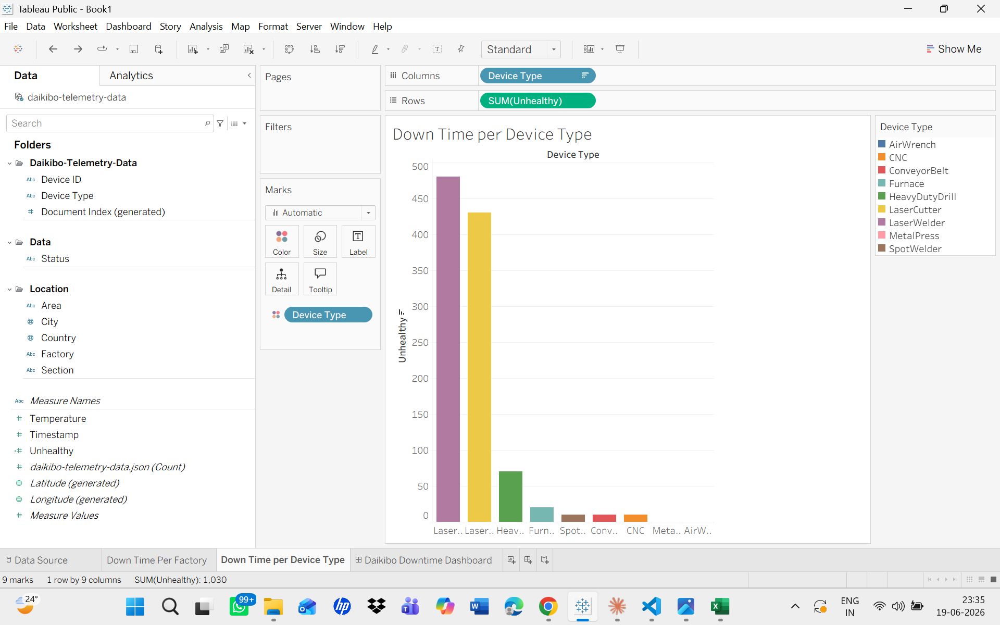
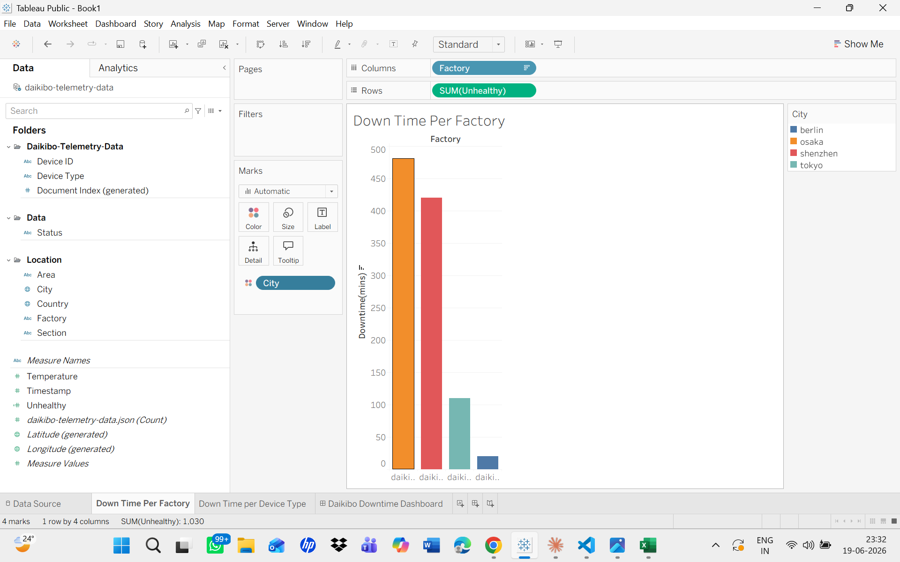
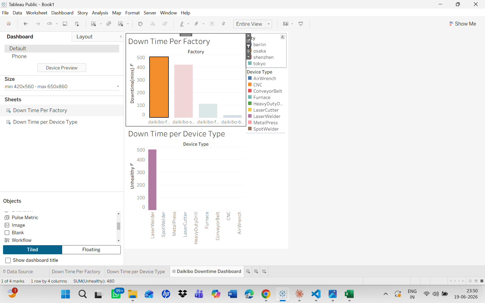

# Deloitte Data Analytics Virtual Internship (Forage)
This repository contains the work completed as part of the Deloitte Data Analytics Virtual Internship conducted via Forage.  
The project focuses on data visualization, analysis, and business insights using real-world datasets.

# Tasks Completed
# Task 1: Tableau Data Visualization (JSON Dataset)
 Worked with JSON data files
 Created interactive dashboards using Tableau
 Generated charts and visual insights

# Task 2: Excel Equality Classification
 Performed data analysis using Excel
 Created classification logic for equality scores
 Organized data into meaningful categories
 Derived insights based on score distribution

# Tools Used
 Tableau 
 Microsoft Excel
 JSON data handling
 Data visualization techniques
 
# Key Learnings
 Data cleaning and preparation
 Dashboard creation in Tableau
 Excel-based data classification
 Data storytelling through visualization

# Visualizations 
# (Task-1) Tableau Data Visualization
1.Shows which device types failed most frequently.
 

2. Shows total downtime across all factories.

3.Shows Factory with maximum Downtime.

# (Task-2)  Excel Equality Classification
1. Performed analysis on employee compensation data using Excel to identify salary distribution patterns and potential inequalities across job roles and departments.
[View Excel Output](task-2/Excel_Data_Analysis/Task_5_Equality_Table_edited.xlsx)

# Outcome
This project helped strengthen my skills in data analysis, visualization, and interpreting business data for decision-making.

